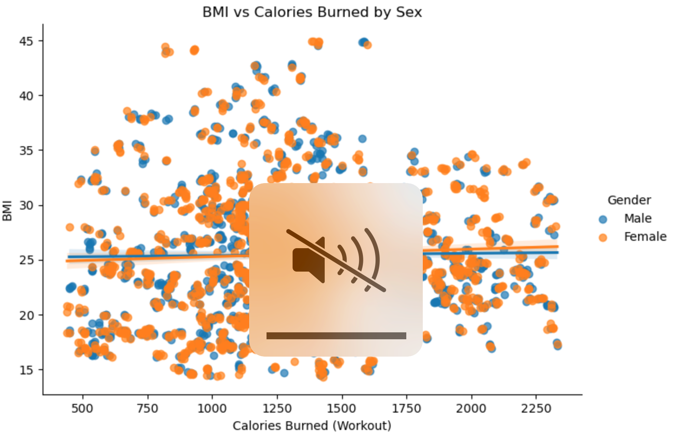

# Maggie Shao

<html lang="en">
<head>
    <meta charset="UTF-8">
    <meta name="viewport" content="width=device-width, initial-scale=1.0">
  
  

  
    
  

    <a href="#about">About</a>
    <a href="#resume">Resume</a>
    <a href="#projects">Projects</a>
    <a href="#skills">Skills</a>
    <a href="#contact">Contact</a>
    

    <h2>About Me</h2>
    
Hi, I'm Maggie Shao👋! I'm a student at University of California, San Diego right now. I have a deep love for data and a curiosity about where they can lead me. I am passionate about leveraging technical and
analytical expertise to address inequality and promote greater equity through innovative. Welcome to my personal website! 

    

    <h2>My Resume 📃</h2>
    <a href="https://drive.google.com/file/d/1gifMy_pdcfIAp33yyFBZNE45BQ1BpVW-/view?usp=sharing" target="_blank">Resume</a>

  <h2>Projects</h2>

  ### Project 1: Sex Differences in Obesity Predictors  
*Sep 2025 – Dec 2025*

This project analyzes obesity-related health data to identify key predictors of BMI and examine how these factors differ across sex using exploratory data analysis, visualization, and statistical methods.

Calories burned during workouts show a weak relationship with BMI across genders, suggesting BMI is influenced by multiple factors beyond exercise alone.

        <strong>Project 2: Song Recommender System | UC San Diego | Oct 2024 – Nov 2024</strong>

    
        <strong>Project 2: progammer, Line - Follower Robot | Sep 2023 - Jun 2024</strong>

Collaborated with team members to initiate and develop the “Line Follower Robot” project. 
Assembled the robot and integrated a grayscale sensor to enhance functionality. 
Self-taught entry-level C++ and Arduino programming to design and implement the robot’s functions. 
Imported data into the robot system and tested the L298N Motor Driver for performance optimization. 
Successfully showcased the finalized project at the Science Fair, demonstrating its functionality and technical capabilities..</li> 
        <li><strong>Project 2: Song Recommender System | UC San Diego | Oct 2024 – Nov 2024</strong>

Organized and analyzed a large dataset of songs as part of a class project, achieving an impressive score of 50.9/52. 
Developed a song recommender system using Pandas in Python to predict the favorite Taylor Swift songs based on a user’s input. 
Created clear and effective data visualizations to present key insights, showcasing strong analytical and communication skills. 
Applied advanced concepts from UCSD's Principles of Data Science course to deliver a functional and engaging recommendation tool.</li> 
        <li><strong>Project 3: TV Show Reboot Predictor| UC San Diego | Nov 2024 – Dec 2024</strong>
        
Used the "Friends" TV show dataset to write a system using Pandas in Python that analyzed viewership, ratings, and other parameters. 
Predicted the most successful qualities of a potential show reboot based on the dataset. 
Applied concepts from UCSD's Principles of Data Science course to create a functional prediction model.</li>
   
<h5>Example Image</h5>
    

    <h2>Skills</h2>

    

    <h2>Contact</h2>
    
Email: yis082@ucsd.edu /maggie050906@gmail.com

    
LinkedIn: www.linkedin.com/in/maggie-shao-7079302b0

    
GitHub: MaggieShao.github.io

<footer>
    
&copy; 2025 Maggie Shao. All rights reserved.

</footer>
